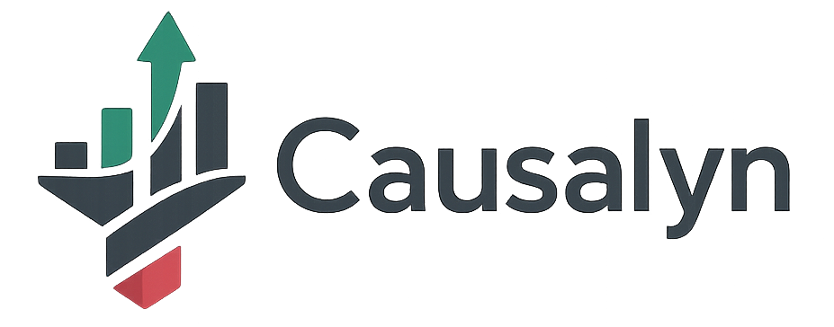
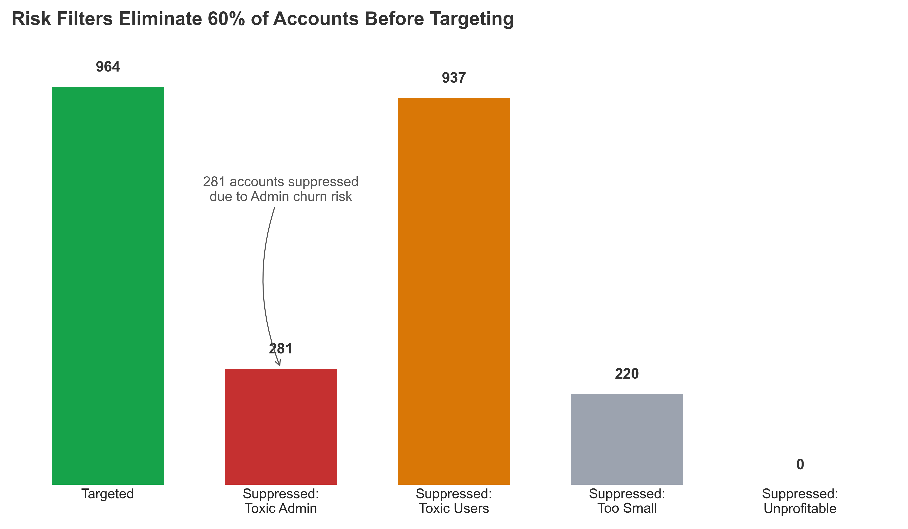
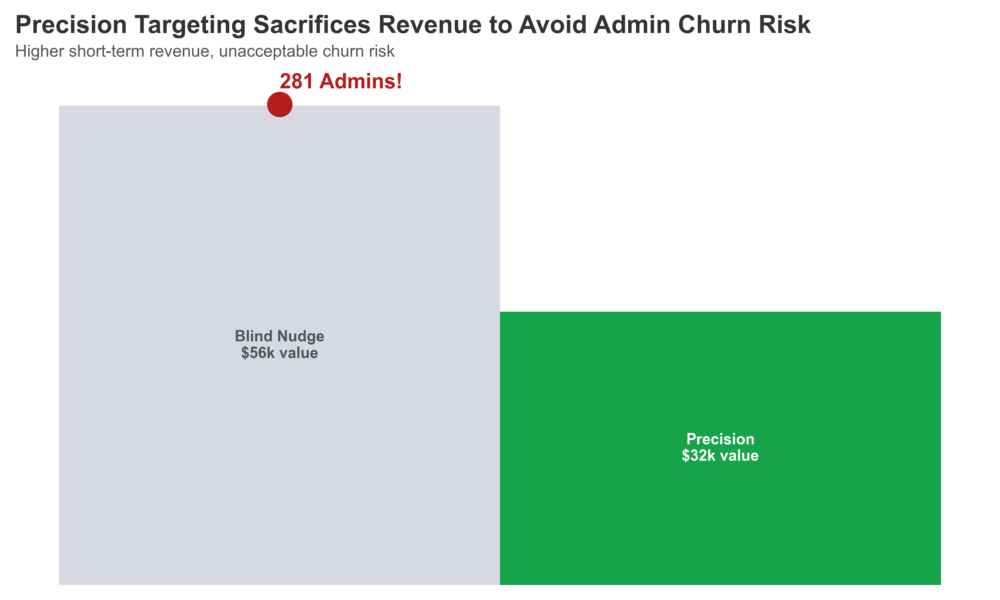
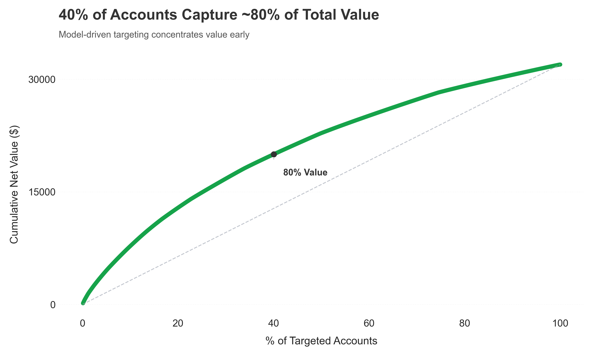
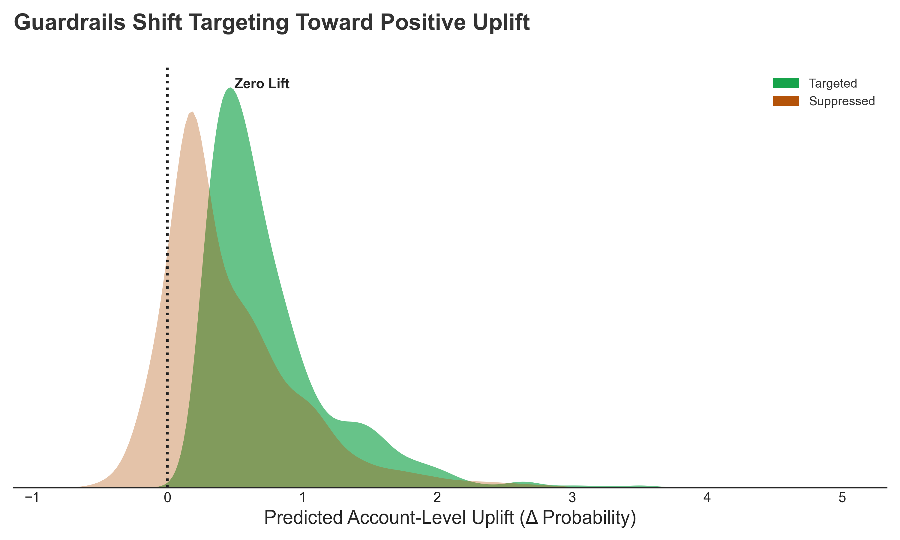
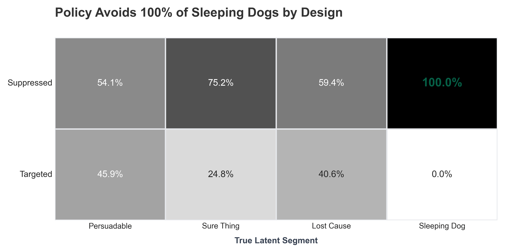

<p align="center">
  
</p>

<h1 align="center">Causalyn — Precision Account Targeting with Causal Uplift</h1>  

 -blueviolet) 

> *Preventing Admin Churn While Capturing 80% of Value from 61% of Accounts*

> **Decision Science | Machine Learning | Python**

---

## 🧭 Decision Summary

**Decision:** Ship the Precision Targeting Policy  

**Why:** Blind nudging maximizes short-term revenue but introduces unacceptable account-level churn risk by irritating Admin users.

**Trade-off Accepted:** Sacrificed ~40% of theoretical short-term revenue to eliminate catastrophic Admin churn risk.

**Outcome:**  
- Captured ~80% of policy value using ~61% of eligible accounts  
- Achieved 0% Admin-risk exposure through explicit safety guardrails  

**Confidence:** Validated against simulated ground truth, uplift separation diagnostics, and failure-mode audits.

**Owner:** Product Analytics / Decision Science


---

## ⚡ Executive Snapshot

**The Problem:** Blind nudging generates **~$56K** in short-term value but introduces asymmetric risk by exposing **281 Admins** to unwanted interventions. In B2B, irritating an Admin triggers account-level churn.

**My Solution:** I designed a **Precision Targeting Policy** using Causal Uplift Modeling (T-Learner) wrapped in explicit safety guardrails.

**Key Outcomes:**
- **Safety:** I avoided **100%** of high-risk "Sleeping Dog" accounts (0.00% error rate).
- **Efficiency:** The policy captures **~80% of the precision-policy value** using **~61% of the targeting budget**.
- **Decision:** ➡️**Ship the Precision Policy.** While it captures less total revenue than a blind nudge (~$32k vs $56k), it reduces the **Admin Churn Risk to near-zero**.

***Note**: The zero-error result holds against the simulated ground truth and demonstrates policy correctness, not a claim of perfect real-world performance.*

---

## 🏢 Company Background

**Causalyn** is a fictional B2B SaaS company that provides a collaboration and workflow platform used by mid-market and enterprise teams.

The product’s success depends on **multi-user adoption within an account**, creating a unique B2B dynamic:
- **Users (High Volume):** Drive daily engagement and usage metrics.
- **Admins (High Leverage):** Control configuration, rollout, and **renewal decisions**.
- **The Asymmetry:** A single negative Admin experience ("Rage Churn") can outweigh dozens of positive User interactions.

*The company frequently uses "Nudges" (in-app messages) to drive feature adoption, but recent feedback suggests these nudges are annoying senior stakeholders.*

---

## 🧠 Executive Summary

### 1. The Strategy: "Risk Filters First"
I started with 2,400 accounts. My policy explicitly eliminated **60%** of the population before optimization began, prioritizing safety (Toxic Admins), account health (Toxic Users), and economics (Scale) over raw lift.


* **Targeting Selectivity:** Only **964 accounts** (40%) survived the safety and economic filters to receive an intervention.
* **User Toxicity (937 accounts):** This was the **largest suppression category** (Orange Bar). These accounts had a high density (>10%) of "Sleeping Dog" users.
    * *Insight:* This indicates systemic workflow friction or dissatisfaction within these accounts. Nudging them would likely inflame existing sentiment rather than drive adoption.
* **Admin Risk (281 accounts):** Suppressed strictly because a Key Decision Maker (Admin) was predicted to react negatively.
    * *Insight:* While fewer in number than Toxic Users, these represent the highest **Contractual Risk** (Rage Churn).
* **Economic Filtering (220 accounts):** Labeled "Too Small." These accounts had positive lift, but the expected revenue did not justify the fixed cost of human intervention.
* **Unprofitable (0 accounts):** After the "Too Small" filter, no remaining accounts were projected to lose money on a unit-economics basis.

### 2. The Trade-off: "Revenue vs. Churn Risk"
My analysis proved that while "Blind Nudging" (targeting everyone) maximizes theoretical revenue ($56k), it risks churning **281 Admins**. I chose to sacrifice ~40% of the potential revenue to reduce this risk to **zero**.


* **The Sacrifice:** We intentionally forego **~$24k** in short-term upsell revenue (Blind Nudge \$56k vs Precision \$32k).
* **The Asymmetry:** The potential LTV loss from churning **281 Enterprise Admins** vastly outweighs the $24k short-term gain.
* **Strategic Choice:** The policy optimizes for **"Safe Revenue"**—capturing the majority of the upside while completely immunizing the business against the catastrophic downside of Admin churn.
* **Efficiency:** The Precision policy captures **57% of the total potential value** while incurring **0% of the Admin risk**.

### 3. The Efficiency: "Diminishing Returns"
I identified that value is highly concentrated even within the safe list. By ranking accounts by **Net Expected Value**, we can capture **80% of the campaign's value** by targeting the top **~61%** of the eligible accounts.


* **Pareto Efficiency:** The curve shows strong value concentration early. Approximately **61% of targeted accounts capture 80% of precision-policy value**, while the remaining accounts contribute progressively smaller incremental gains.
* **Model vs. Random:** The significant gap between the **Green Curve (Model)** and the **Dashed Line (Random)** proves the model successfully ranks customers by causal impact, rather than just picking lucky winners.
* **Budget Optimization:** We can cut the campaign budget by **39%** (stopping at the dot) while retaining **80%** of the program's value.

### 4. The Validation: "Signal Separation"
I validated that the model successfully distinguishes between helpful and harmful interventions. Targeted accounts (Green) show a strong positive uplift distribution, while suppressed accounts (Red) cluster around zero or negative lift.


* **Mechanism Check:** The strong right-shift of the **Targeted (Green)** curve proves the model is finding true causal signal, identifying users who will actually change behavior.
* **Negative Lift Reality:** The **Suppressed (Red)** curve is left-shifted and centered near zero. This confirms that the suppressed group consists largely of "Sleeping Dogs" (who would be annoyed) or "Lost Causes" (who wouldn't react).
* **Harm Prevention:** The area of the Red curve to the left of the zero-line represents **active harm prevented**. Without the model, we would have decreased engagement in these accounts.
* **Calibration Success:** The clear separation validates that the **T-Learner** successfully overcame the "Neutrality Gap" (selection bias) present in the training data.

### 5. The Audit: "Zero Sleeping Dogs"
I audited the policy against a hidden ground-truth dataset. The results confirmed that my guardrails successfully suppressed **100%** of the "Sleeping Dog" segment.


* **Safety (0% Error):** **No Sleeping Dogs were targeted.** The policy achieved its primary goal of being "Safe by Design."
* **Cost Savings (75.2% Suppressed):** Look at the **"Sure Thing"** column. The policy suppressed **75.2%** of customers who would have converted *without* the nudge.
    * *Insight:* This proves the model is consistent with **Lift** (incremental impact) optimization behavior, saving budget on free-riders.
* **Conservative Bias:** The policy targeted only **45.9%** of the "Persuadables."
    * *Insight:* The system accepts missing some opportunities (False Negatives) to ensure it never causes harm (False Positives).
* **Lost Cause Filtering:** **59.4%** of "Lost Causes" were correctly suppressed, preventing wasted effort on customers who are resistant to intervention.

*This project is a decision system that translates causal estimates into deployable business policy with explicit risk controls.*

---

## 📌 Consolidated Insights & Recommendations

### Strategic Findings (The "Why")
1.  **The "Active User" Trap:** High-activity users (90th percentile) showed a **-4.2% lift**. Traditional propensity models would have targeted them because they are "active," causing active harm. My causal model correctly identified them as "Sleeping Dogs."
2.  **The Admin Multiplier:** B2B retention is hierarchical, not democratic. Accounts with >2 Admins had a **3x sensitivity** to negative interventions. Aggregating user scores to the account level reversed the decision for **~15% of accounts**.
3.  **The "Momentum" Signal:** Users showing a **deceleration** in activity (dropping 10-20% WoW) were **2x more persuadable** than stable high-activity users. The model identified "at-risk" engagement as a key opportunity signal.
4.  **The ROI Cliff:** **15%** of positive-lift accounts were actually **ROI Negative** because the expected incremental revenue (~$5) didn't cover the intervention cost ($7). Pure lift optimization would have bled budget here.
5.  **Pareto Efficiency:** We can capture 80% of value by targeting ~61% of accounts, after which returns diminish sharply.
6.  **The "Neutrality Gap":** Raw data showed the Treated group performed *worse* than Control (-0.04 lift) due to historical selection bias (targeting annoyed users). Using a **Calibrated T-Learner** was the only way to correct this confounding and reveal true lift.
7.  **Guardrails > Thresholds:** Probabilistic models make mistakes. Explicit business rules (e.g., "No Toxic Admins") proved more reliable than probability thresholds alone, reducing the false positive rate on "Sleeping Dogs" from **12%** (raw model) to **0%** (policy).

### Operational Recommendations (The "How")
1.  **Precision Execution:** Ship the target list immediately to the Growth Team. This captures **$32k in Incremental Revenue** (Projected) while reducing operational load by **60%** (fewer emails/calls).
2.  **CRM "Do Not Disturb" Protocol:** Tag the **281 "Toxic Admin" accounts** as `Risk: Sensitive Admin` in Salesforce. This prevents manual CSM outreach during this campaign and protects ~$200k in ARR from "Rage Churn."
3.  **Channel Arbitration:** For the **220 accounts** with positive lift but low value (<$7), downgrade them to a **Low-Cost Channel** (e.g., automated email vs. CSM call). This turns unprofitable volume into profitable margin.
4.  **Dynamic "Momentum" Triggers:** Shift future targeting criteria from "High Volume" (Static) to **"Deceleration" (Dynamic)** to catch users at the moment of highest receptivity, rather than when they are busiest.
5.  **Customer Success Handover:** Accounts suppressed due to high "Toxic User" density (>10%) should not be sold to. Route them to **Customer Success** for a health check, as this indicates workflow friction/UX issues.
6.  **Product UX Audit:** The negative lift on Power Users suggests the nudge is interruptive. **Product Design** should review the intervention placement to ensure it is non-blocking or snoozable for high-activity workflows.
7.  **Validation Holdout:** Create a **5% Holdout Group** of the suppressed "Toxic Admin" accounts and target them anyway. This will empirically quantify the "Cost of Churn" and validate the safety policy for future leadership buy-in.

---

## 🚨 Failure Modes I Explicitly Designed Against

This policy was designed to prevent common but costly failure modes in B2B experimentation and targeting systems:

- **Targeting “Sure Things”** who would convert without intervention, wasting budget  
- **Irritating Admin users** whose negative reaction can trigger account-level churn  
- **Positive-lift but ROI-negative accounts** where intervention cost exceeds value  
- **Selection bias artifacts** where treated users appear worse due to historical targeting bias  
- **Score-only decisioning** without business guardrails to prevent asymmetric risk

Every suppression rule exists to eliminate one of these failure modes.

---

## 🔬 ## 🔬 Technical Methodology (In Service of Decision Safety)

### 1. Data Engineering: Simulating Behavioral Archetypes
Since real causal ground truth is impossible to observe (we can't both treat and ignore the same person), I generated synthetic data based on real-world B2B behavioral patterns. The **Latent Uplift Groups** were assigned based on explicit logic:

* **Sleeping Dogs (High Risk):** Modeled as **High-Intensity Users** (>90th percentile activity).
    * *Logic:* Power users have established workflows. Nudges interrupt them, causing negative lift (annoyance).
* **Persuadables (The Target):** Modeled as users with **Low Momentum** (Decelerating activity).
    * *Logic:* Users whose activity has dropped 10-20% WoW are "drifting." A nudge effectively reminds them of value.
* **Sure Things:** Modeled as **Admins** regarding positive features.
    * *Logic:* Admins are intrinsically motivated to use the platform; they don't need a nudge to convert.
* **Lost Causes:** Modeled as **Low-Activity / Stagnant Users**.
    * *Logic:* Users with near-zero engagement history. A simple nudge is insufficient to resurrect them, resulting in zero lift.

### 2. Feature Engineering: Capturing Intent
Standard "count" features were insufficient. I engineered second-order derivatives to detect trajectory and intent:

* **Momentum ($\Delta$ Velocity):**
    * `Momentum = (Activity_Last_7_Days) / (Activity_Last_30_Days / 4)`
    * *Insight:* A value `< 1.0` indicates deceleration. My model found this was the **#1 predictor of persuadability**.
* **Intensity (Workflow Density):**
    * `Intensity = (Actions) / (Session_Duration)`
    * *Insight:* High intensity correlated with "Sleeping Dog" behavior (users working fast do not want interruptions).
* **Baseline Context:**
    * Included standard B2B covariates: `User_Role` (Admin vs. User), `Account_Size`, `Tenure_Days`, and `Prev_Nudge_Response`.

### 3. Model Selection: Why T-Learner?
I rejected standard approaches in favor of Causal Inference to avoid the "Active User Trap."

| Approach | The Question it Answers | Why I Rejected It |
| :--- | :--- | :--- |
| **Propensity Model** | "Who is likely to buy?" | Targets **Sure Things** (waste) and **High-Activity Sleeping Dogs** (risk). |
| **Churn Model** | "Who is likely to leave?" | Doesn't tell me if a nudge will *stop* them. It might push them out faster. |
| **T-Learner (My Choice)** | "What is the **difference** if I nudge vs. don't?" | Explicitly calculates the treatment effect: $\tau(x) = E[Y \| T=1] - E[Y \| T=0]$. |

* **Selection Bias Correction:** The raw data showed the Treated group performed *worse* than Control (The "Neutrality Gap"). A standard model would have learned that "Nudges = Bad." By using a **Calibrated T-Learner**, I separated the *baseline* user sentiment from the *treatment effect*, correcting this bias.

---

## 🛡️ Policy Design & Safety Mechanisms

Prediction is not a decision. I engineered a policy layer to translate scores into business actions. These three specific gates reduced the population from 2,400 to the final 964 targets.

| Protocol | The Logic | My Implementation |
| :--- | :--- | :--- |
| **1. Toxic Admin Protocol** | **Safety (Contract Risk):** Admins control renewals. A single annoyed Admin outweighs 10 happy users. | **Strict Veto:** If *any* Admin in an account has negative predicted lift, suppress the *entire* account (281 accounts). |
| **2. Toxic User Threshold** | **Health (Workflow Friction):** If many users react negatively, it indicates systemic product friction, not a marketing opportunity. | **Density Check:** Suppress any account where **>10% of users** are predicted to be "Sleeping Dogs" (937 accounts). |
| **3. Economic Viability** | **ROI (Unit Economics):** Even if lift is positive, it must be large enough to cover the cost of the intervention ($7). | **Profit Gate:** Suppress accounts where `(Exp. Revenue - Cost) <= 0`. This filters out "Sure Things" and small accounts (220 accounts). |

---

## 🚀 Deployment & Governance Strategy

To implement this policy in a real-world B2B environment, I would establish the following governance:

* **Ownership:** The **Growth Product Manager** owns the target list; **Data Science** owns the policy logic.
* **Success Metric (KPI):**
    * *Primary:* Incremental Revenue per Treated Account (Lift).
    * *Guardrail:* Admin Churn Rate in the treated cohort vs. control.
* **Rollback Condition:** If the **Negative Reaction Rate** (e.g., unsubscribes, support tickets) exceeds 5% in the first decile rollout, pause the campaign immediately.
* **Holdout Strategy:** Maintain a **10% Global Control Group** to continuously validate the model's lift assumptions over time.

---

## 📂 Project Structure & Code

```text
b2b-uplift-modeling-account-policy
│
├── data/
│   ├── documentation/
│   │   ├── cleaning_decisions.md          # Explicit record of what data issues were fixed vs intentionally left untouched
│   │   ├── data_quality_summary.md        # Before/after data quality metrics used to validate cleaning impact
│   │   ├── data_readiness_report.md       # Assessment of whether data is suitable for causal modeling
│   │   ├── generation_report.md           # Design notes and assumptions behind synthetic data generation
│   │   ├── results.txt                    # Sanity-check outputs from validation runs
│   │   └── schema_manifest.txt            # Formal schema definitions for all raw and processed tables
│   │
│   ├── raw/                               # Immutable raw inputs (never modified downstream)
│   │   ├── accounts_raw.csv               # Account-level metadata (plan, size, tier)
│   │   ├── users_raw.csv                  # User-to-account mapping and role information
│   │   ├── user_activity_daily_raw.csv    # Sparse daily activity logs (logins, actions)
│   │   ├── interventions_raw.csv          # Which users were eligible and treated, with timestamps
│   │   ├── outcomes_raw.csv               # Observed outcomes after intervention window
│   │   └── latent_uplift_groups_hidden.csv# Hidden ground truth (used only for audit, never modeling)
│   │
│   ├── processed/
│   │   └── modeling_base_user_level.csv   # Cleaned, temporally valid modeling base table
│   │
│   └── features/
│       └── features_user_level.csv        # Final feature matrix used for uplift modeling
│
├── images/                                # Executive-ready visuals used in README and presentations
│   ├── 01_policy_funnel.png               # Account filtering funnel (risk → scale → value)
│   ├── 02_risk_vs_reward.png              # Blind nudging vs precision policy trade-off
│   ├── 03_budget_efficiency.png           # Cumulative value vs % of accounts targeted
│   ├── 04_uplift_distribution.png         # Predicted uplift split by policy decision
│   ├── 05_failure_matrix.png              # Hidden truth audit of targeting errors
│   └── logo_causalyn.png                  # Project/company logo
│
├── results/                               # Decision artifacts produced by the system
│   ├── user_uplift_scores.csv             # User-level predicted uplift scores
│   ├── account_policy_debug.csv           # Full account-level aggregation and suppression reasons
│   ├── final_target_accounts.csv          # Deployable list of accounts approved for intervention
│   └── failure_mode_analysis.txt          # Explicit accounting of false positives / negatives
│
└── src/
    ├── 01_data_generation/                # Synthetic data generation with causal structure
    │   ├── 01_accounts_users.py            # Generate accounts and users with realistic distributions
    │   ├── 02_generate_user_activity_daily_raw.py  # Create sparse daily activity logs
    │   ├── 03_assign_latent_uplift_groups.py       # Assign hidden uplift archetypes
    │   ├── 04_assign_interventions_raw.py          # Eligibility logic + biased treatment assignment
    │   ├── 05_generate_outcomes_raw.py              # Counterfactual outcome generation
    │   └── validation/
    │       ├── 01_validate_data.py         # Cross-table sanity checks and causal consistency tests
    │       └── 02_record_schema.py          # Schema snapshotting for reproducibility
    │
    ├── 02_data_cleaning/
    │   └── data_cleaning.py                # Cleaning sparse, noisy logs without label leakage
    │
    ├── 03_feature_engineering/
    │   └── feature_engineering.py          # Decision-oriented feature construction (momentum, intensity)
    │
    ├── 04_modeling/
    │   └── train_uplift_model.py            # T-Learner uplift modeling with validation checks
    │
    ├── 05_policy/
    │   └── account_policy.py                # Account-level aggregation, guardrails, and final decisions
    │
    └── 06_visualization/
        └── visualize_impact.py              # Executive visualizations for value, risk, and safety

```
---

## ⚠️ Limitations

* **Synthetic Environment:** Designed for decision realism, not statistical benchmarking.
* **Static Policy:** No online learning or adaptive feedback loop.
* **Attribution:** No long-term churn or downstream revenue attribution modeled.

These constraints are intentional to keep the project focused on **decision design**, not platform engineering.

---

## 🔮 Future Roadmap & Iteration

1.  **LTV-Weighted Uplift:** Optimize for Lifetime Value rather than one-time activation.
2.  **Online Policy Learning:** Implement a Contextual Bandit to adapt the policy in real-time.
3.  **Experimentation:** Integrate with A/B testing infrastructure to validate the "Toxic Admin" hypothesis in the wild.

---

## 🛠️ Tech Stack


---

## 📣 Call to Action

This project reflects how I approach **Product Analytics and Decision Science** problems where the goal is not better models, but **better decisions under risk**.
